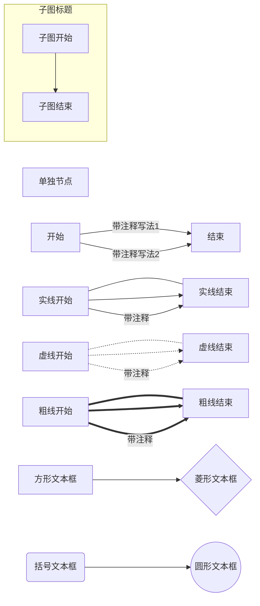
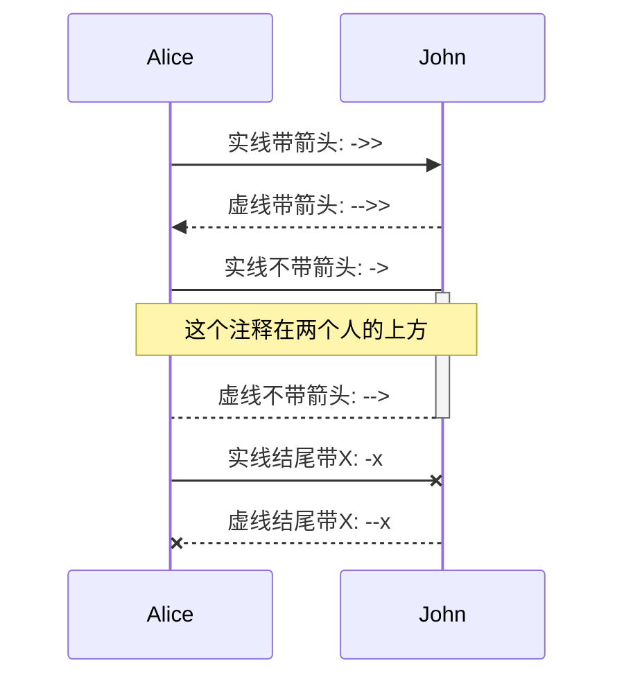
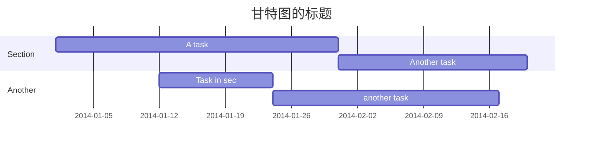

Mermaid绘图语法总结
====

本文主要介绍 Mermaid 的语法，关于Atom如何支持 Mermaid 参考这篇文章

如果想要测试 Mermaid语法的话，可以使用 Mermaid [Cmd在线编辑器](https://zybuluo.com/mdeditor)或者 [Atom编辑器](https://atom.io/)

----
## Atom安装插件

由于atom自带的preview工具支持的功能比较少，所以
最好安装上markdown-preview-enhanced插件
*markdown-preview-enhanced* 插件支持mermaid绘制流程图等，还支持使用MathJax书写数学公式，十分强大

### 安装过程

1. 首先ctrl+shift+p打开搜索框，敲入setting view:open,选择install栏，搜索markdown-preview-enhanced,找到并安装即可
2. 安装后在package栏选择disable原来的markdown-preview即可

### 使用方法

安装好后使用方法和atom自带的preview工具快捷键相同，都是 *ctrl+shift+m*

__需要注意的一点是__ 新建的文件必须是 *.md* 等文件后缀，否则插件无法识别，无法渲染界面

----

## *mermaid绘图语法*

__需要注意的一点是__ 在atom中写mermaid必须按照这种格式

\`\`\`mermaid
图的类型名,如sequenceDiagram,gantt
  具体图的定义语块
\`\`\`
\`为反斜杠

----
### 流程图

\`\`\` mermaid
graph LR
  单独节点
  开始 -- 带注释写法1 --> 结束
  开始 --> |带注释写法2| 结束
  实线开始 --- 实线结束
  实线开始 --> 实线结束
  实线开始 -->|带注释| 实线结束
  虚线开始 -.- 虚线结束
  虚线开始 -.-> 虚线结束
  虚线开始 -.->|带注释| 虚线结束
  粗线开始 === 粗线结束
  粗线开始 ==> 粗线结束
  粗线开始 ==>|带注释| 粗线结束
  subgraph 子图标题
    子图开始 --> 子图结束
  end
  节点1[方形文本框] --> 节点2{菱形文本框}
  节点3(括号文本框) --> 节点4((圆形文本框))
\`\`\`

#### 显示效果如下



#### 语法讲解
* 图的方向支持一下几种方式：
```
graph LR

TB - 从上到下(top buttom)
BT - 从下到上(buttom top)
LR - 从左到右(left right)
RL - 从右到左(right left)
TD - 跟 TB 相同
```
* 三种线类型
```
--- : 实现
-.- : 虚线
=== : 粗线
```
* 虚线带箭头的话加 > ，实线和粗线则最后一个字符替换成 >
```
-- 中间加注释写法 -->
-->|后边加注释写法|
```
* 注释的两种写法(中间加注释，后边加注释)
```

```
* 文本框类型
```
[] - 方形文本框
{} - 菱形文本框
() - 边角圆滑文本框
(()) - 圆形文本框
```
* 子图
```
subgraph 子图标题
  子图开始 --> 子图结束
end
```
----
#### 为了显示mermaid绘制流程图和一般绘制流程图的区别，下面是一般绘制流程图的语块和显示效果

##### 语块

\`\`\`flow

st=>start: Start:>http://www.google.com[blank]
e=>end:>http://www.google.com
op1=>operation: My Operation
sub1=>subroutine: My Subroutine
cond=>condition: Yes
or No?:>http://www.google.com
io=>inputoutput: catch something...

st->op1->cond
cond(yes)->io->e
cond(no)->sub1->op1
\`\`\`

##### 显示效果(上传博客后发现博客上无法正常显示，可能是hexo无法实现渲染，所以估计只能在本地atom上显示)

```flow

st=>start: Start:>http://www.google.com[blank]
e=>end:>http://www.google.com
op1=>operation: My Operation
sub1=>subroutine: My Subroutine
cond=>condition: Yes
or No?:>http://www.google.com
io=>inputoutput: catch something...

st->op1->cond
cond(yes)->io->e
cond(no)->sub1->op1
```

可以看出两者风格不同，mermaid更像是插在页面中的图片

----
### 时序图
时序图以 *sequenceDiagram* 开头声明

#### 语法如下所示
\`\`\` mermaid
sequenceDiagram
    participant Alice
    participant John
    Alice ->> John:  实线带箭头: ->>
    John -->> Alice: 虚线带箭头: -->>
    Alice -> John : 实线不带箭头: ->
    activate John
    Note over Alice,John: 这个注释在两个人的上方
    John --> Alice : 虚线不带箭头: -->
    deactivate John
    Alice -x John : 实线结尾带X: -x
    John --x Alice : 虚线结尾带X: --x
\`\`\`

#### 显示效果如下所示



#### 语法讲解
* 参与者（participant）
```
participant 名称1
participant 名称2
participant A as Alice  : 通过 as 定义别名，后续使用 A 比较方便
```
* 激活参与者
```
可以通过在 > 后面使用 +/- 符号表示激活和去激活，例如：

Alice->>+John: Hello John, how are you?
```
* 注释
```
Note [ right of | left of | over ] [Actor]: Text in note content

注: Actor 可以是多个，通过逗号分割，例如：

Note over Alice,John: A typical interaction
```
* 循环序列
```
loop 描述文本
... 时序图语句 ...
end
```
>##### 例子
>\`\`\`
sequenceDiagram
    Alice->John: Hello John, how are you?
    loop Every minute
        John-->Alice: Great!
    end
\`\`\`
>##### 显示效果
>  ```mermaid
>  sequenceDiagram
>      Alice->John: Hello John, how are you?
>      loop Every minute
>          John-->Alice: Great!
>      end
>  ```

----
同样的，markdown也有一般的时序图绘制语法
#### 语法如下

\`\`\`sequence

Andrew->China: Says Hello
Note right of China: China thinks
China->Andrew: How are you?
Andrew->China: I am good,thanks
\`\`\`

#### 显示效果如下(上传博客后发现博客上无法正常显示，可能是hexo无法实现渲染，所以估计只能在本地atom上显示)
```sequence

Andrew->China: Says Hello
Note right of China: China thinks
China->Andrew: How are you?
Andrew->China: I am good,thanks
```

----

### 甘特图

甘特图以 *gantt* 开头，用 *section* 划分任务集
#### 语法如下：

\`\`\`mermaid
gantt
    title 甘特图的标题
    dateFormat  YYYY-MM-DD
    section Section
    A task           :a1, 2014-01-01, 30d
    Another task     :after a1  , 20d
    section Another
    Task in sec      :2014-01-12  , 12d
    another task      : 24d
\`\`\`

#### 显示效果如下



#### 语法讲解

> 最开始是描述信息，定义图的类型，日期格式和标题。接下来，每个section就是一个项目。项目中，每一行就是一个任务。任务有名称和属性两部分组成，由英文冒号”:”分开。属性意义：
> * done 当前任务已经结束，如果没结束不用标记，必须为第一个.
> * crit 当前任务很重要，用红色高亮显示，可用于标记里程碑，必须为第一个。
> * active 当前任务正在进行中
> * 任务id 必须全局唯一，可被后续任务引用，在状态后面（如果有状态描述）。此操作比较灵活，只需修改起始工作的时间，后置（after标记）任务时间全部会改变。如果没有后续依赖，也可省略任务id。
> * 最后是任务时间，一般需要两个，开始和结束时间。可以是绝对时间或相对时间，非常灵活。

#### 甘特图没有发现一般的绘制方法，想要整合到markdown中只能使用mermaid

## 最后感谢一下在网上搜集这部分语法资源时遇到的好博客
[Joans Blog](http://blog.lisp4fun.com/)
[Markdown入门参考](http://itmyhome.com/markdown/article/about/readme.html)
[一数一世界的Blog](http://bourneli.github.io/)
