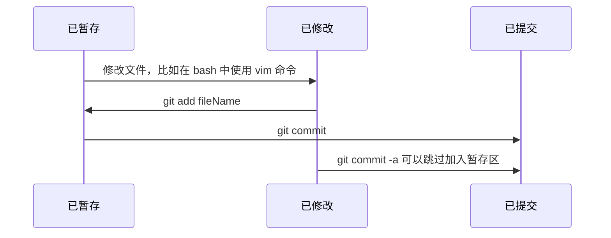
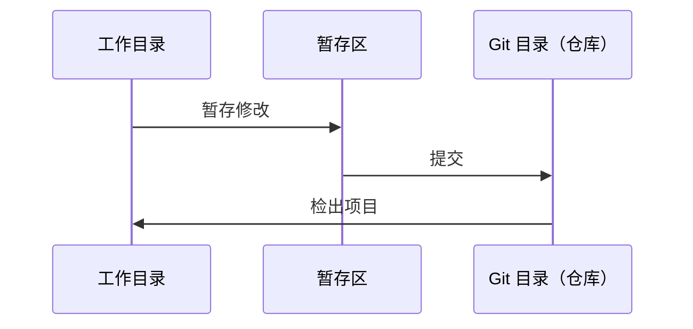

# Pro Git 笔记（1）

## 第 1 章 入门

### 文件的三种状态

#### **已提交**（git commit 命令后）
> 已提交表示数据已经安全地存入本地数据库。

已提交代表文件的快照已经被存入 Git 仓库，会有历史记录，可以通过一些操作返回这个状态。

#### **已修改**（修改了文件后没有 add）
> 表示已改动文件，但尚未提交到数据库。

已修改表示文件在工作目录（也是我们唯一可以见到的目录）中对文件进行了一些修改后文件的状态。

#### **已暂存**（git add 命令后）
> 表示对已修改的文件的当前版本做出了标识并将其加入下一次要提交的快照中。

已暂存表示文件已经被拍下快照。

#### 三种状态图示


#### **对于快照的个人理解**
快照就像字面意思一样，对所有文件拍了一张照片，有照片的话我们就能知道原来文件的状态，只要文件数据还在，我们就可以重新摆放文件回到原来照片中文件的状态。Git 储存的就是快照，而不是每次提交的时候备份一次。相比每次备份一次，快照占的体积肯定更小，就像一张拍得很仔细的照片和一间摆好原来家具位置的房间一样。
PS：刚开始写 Android 课设时，因为有的时候会出现不知名的 Session 错误，于是我就每次写完一个功能备份一次，导致文件夹占的体积很大...学习了一点 Git 知识后觉得 Git 真强大。

### Git 项目中的三个主要区域

#### **工作目录**
> 工作目录是项目某个版本的单次检出。这些文件从 Git 目录下的压缩数据库内被提取出，放置在磁盘上以供使用和修改。

工作目录就是我们使用 Git 时可以见到的文件目录，我们在这个目录进行文件的使用和修改，每次我们切换分支后都可以看到目录中文件的变化。

#### **暂存区**
> 暂存区是一个文件，一般位于 Git 目录中。它保存了下次所要提交内容的相关信息，有时候也被称为“索引”。

暂存区就是文件快照的仓库，不过每次只储存当前最新的快照，文件修改后的或者上一次提交前的快照是没有的。

#### **Git 目录**
> Git 保存项目元数据和对象数据库的地方，是 Git 最重要的部分，也是其他计算机中克隆仓库时要复制的内容。

个人理解就是储存了每次提交的快照，和最开始的文件元数据的目录。复制了这里，自然可以根据文件元数据和快照恢复到任何状态。

#### 三种目录图示


### Git 的首次配置

#### 用户身份
```git
git config --global user.name "DateBro"
git config --global user.email sdudatebro@gmail.com
```
传入 --global 参数，配置一次就好了，否则以后每次修改 git 项目时都要配置。

#### 其他配置

###### 比如编辑器之类的：
`git config --global core.editor vim`

##### 检查个人设置
`git config --list` 会列出你的个人设置

## 第 2 章 Git 基础

### 几个基本命令

> 初始化 Git 仓库：git init
> 跟踪文件：git add fileName
> 查看文件状态：git status
> 克隆仓库：git clone fileOnline
> 暂存已修改的文件：git add fileName
> 查看工作目录中文件变更内容比较：git diff
> 重命名文件：git mv file_from file_to
> 查看提交历史：git log
> 移除文件：git rm
> 查看远程仓库设置：git remote
> 列举所有标签：git tag
> 设置别名：比如 git config --global alias.co checkout

### 常用命令的升级版

#### _git status_
> 显示更简洁的状态信息：git status -s 或者 git status --short

#### _git diff_
> 查看工作目录中文件和暂存区文件区别使用不加参数的 git diff
> 对比暂存区与上次提交的快照 git diff --staged

#### _git commit_
> 普通的填写提交信息不加参数即可
> 在填写提交信息时对比差异内容：git commit -v
> 直接在命令行写提交信息：git commit -m "..."
> 提交时跳过暂存区（不过文件必须是已跟踪的）：git commit -a
> 修改上次提交信息：git commit -amend

#### _git rm_
> 文件已暂存时移除文件：git rm -f
> 从暂存区删除文件但工作目录中保留：git rm --cached

#### _git log_
> 显示每次提交引入的差异：-p （应该是 patch 补丁的缩写）
>
> 查看简要统计信息：--stat（应该是 statistics 的缩写）
>
> 规定日志输出格式：--pretty，比如 git log --pretty=oneline（每一行显示一个提交），其他参数还可以是short,full,fuller,或者是自定义格式的 format（现在来说基本用不着，了解一下就行）。
>
> 简单图表显示日志：--graph
>
> 限制历史的输出范围：-n（显示最新的 n 次提交），--since，--after；--until，--before。比如，git log --since=2.weeks
>
> 其他过滤条件,
>匹配作者：--author
>匹配提交者：--committer
>提交信息包含字符串：--grep（可参考 Linux 系统命令）

#### **撤销操作**
> 撤销暂存文件（把文件移出暂存区）：git reset HEAD fileName
> 加上 --hard 参数时比较危险，需要注意。

> 撤销对文件的修改：git checkout -- fileName
> 这是一条危险的命令，因为他会把之前对文件的所有修改全部删除，回到上次提交时的情景。
> 还有就是注意 -- 前后与字母不相连

#### _git remote_
> 显示远程仓库对应 URL：git remote -v
>
> 添加远程仓库：git remote add [shortname] [url]，之后就可以用 shortname 表示远程仓库，就像 orgin 远程仓库一样。
>
> 拉取远程仓库（但并不会自动合并）：git fetch [remote_name]
>
> 推送到远程仓库：git push [remote_name] [branch_name]，这样就能将本地分支推送到远程仓库
>
> 检查远程仓库：git remote show [remote_name]，这样就会显示远程仓库的详细信息。
> 重命名远程仓库：git remote rename name_1 name_2
>
> 删除远程仓库：git remote rm [remote_name]

#### _git tag_

> 创建注释标签：git tag -a [tag_name] -m "tag info" （a 应该是 annotate 的缩写），不加 -m 的话会和提交信息时一样打开编辑器。
>
> 显示标签内容和相应信息：git show [tag_name]
>
>创建轻量标签：直接 git tag [tag_name] 即可。
>
>补加标签：git tag -a [tag_name] [commit_SHA_value]
>
>推送标签：git push [remote_name] [tag_name]（推送一条标签）
> git push [remote_name] --tags（所有标签）
>
> 在特定标签上新建分支：git checkout -b [branch_name] [tag_name]
